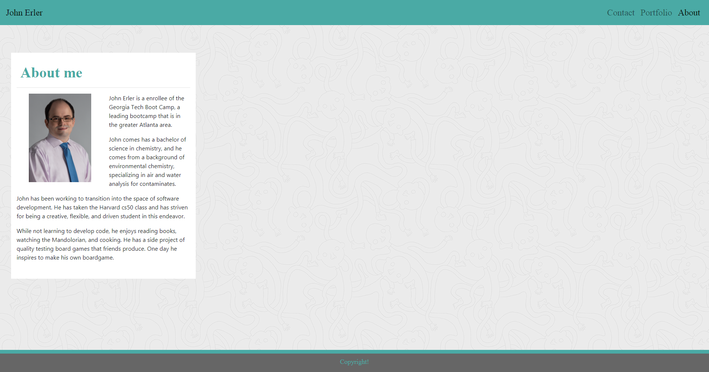
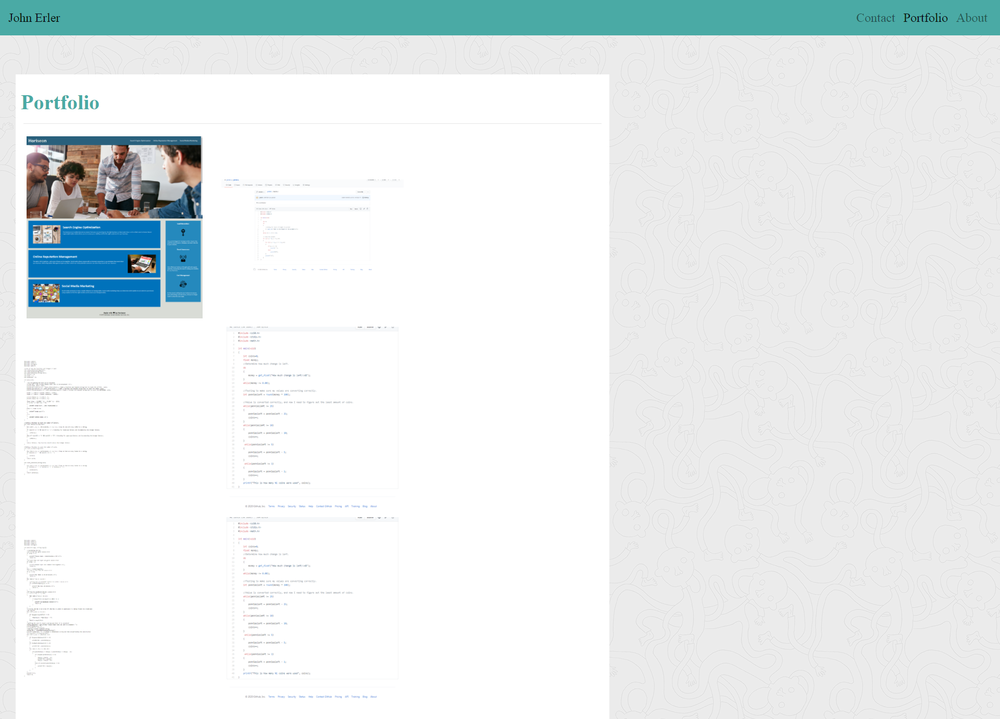
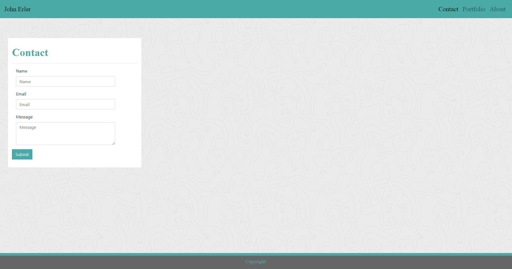

## First Portfolio

#### Table of contents
---

1. [Installation](#installation)
1. [Usage](#usage)
1. [Credits](#credit)
1. [License](#license)

#### Installation
---
These are the steps taken to implement this project:
1. I created the bare bones of the three html pages: portfolio, about me, and contact.
1. Created the link to bootstrap and then implemented my custom css sheet.
1. Implemented a navbar with bootstrap and customized it to my specification.
1. I worked on the about me html page first.  Started the container and inputted my placeholder image and lorem text.
1. Installed a sticky footer.
1. Copied all the relevant skeleton html file from about.html to the other two files.  (including the navbar and sticky footer).
1. Made a container for the form from bootstrap and customized it, which completed contact html.
1. Made a container for the portfolio html and added enough rows and column for the six images being posted on the page.

#### Usage
---

The website is built upon three html pages. They are labeled contact, indexl, and portfolio. There is a navbar at the top for each of these pages. To properly navigate between these pages you need to just click on the link of where you want to go. The links will darken to specify which page you are currently on, and you can click my name in the top left to go to the index page.

#### Credits
---

[Great Markdown Cheatsheet](https://www.markdownguide.org/cheat-sheet/)
[Explaining how to do a sticky footer](https://bootstrapious.com/p/bootstrap-sticky-footer)
[w3 schools](https://www.w3schools.com/)

#### License
----

Copyright (c) 2005-2020 David Heinemeier Hansson

Permission is hereby granted, free of charge, to any person obtaining
a copy of this software and associated documentation files (the
"Software"), to deal in the Software without restriction, including
without limitation the rights to use, copy, modify, merge, publish,
distribute, sublicense, and/or sell copies of the Software, and to
permit persons to whom the Software is furnished to do so, subject to
the following conditions:

The above copyright notice and this permission notice shall be
included in all copies or substantial portions of the Software.

THE SOFTWARE IS PROVIDED "AS IS", WITHOUT WARRANTY OF ANY KIND,
EXPRESS OR IMPLIED, INCLUDING BUT NOT LIMITED TO THE WARRANTIES OF
MERCHANTABILITY, FITNESS FOR A PARTICULAR PURPOSE AND
NONINFRINGEMENT. IN NO EVENT SHALL THE AUTHORS OR COPYRIGHT HOLDERS BE
LIABLE FOR ANY CLAIM, DAMAGES OR OTHER LIABILITY, WHETHER IN AN ACTION
OF CONTRACT, TORT OR OTHERWISE, ARISING FROM, OUT OF OR IN CONNECTION
WITH THE SOFTWARE OR THE USE OR OTHER DEALINGS IN THE SOFTWARE.